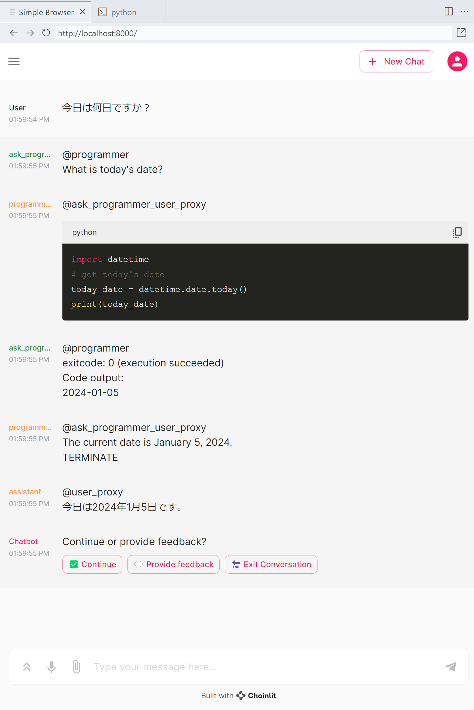

# Usage

```bash
poetry install --no-root
echo "export OPENAI_API_KEY=sk-xxx" > .env

chainlit run autoframe/express/app.py
```



## References

- [model_prices_and_context_window](https://github.com/BerriAI/litellm/blob/main/model_prices_and_context_window.json)
